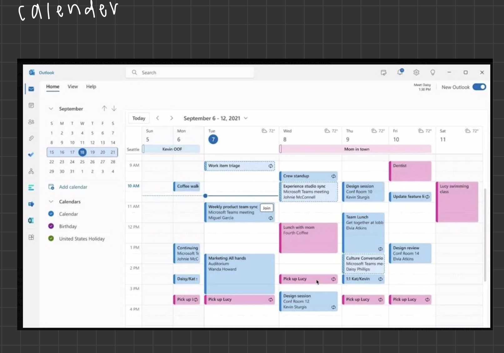

# filter-ai

## How to Setup
1. Clone the repository
2. Run `npm install` to get the node_modules file
3. Create a conda environment
4. Install the requirements.txt file into the conda environment
5. To run React
  - `cd frontend`
  - `npm start`
6. Install Postgres DB
  - https://www.youtube.com/watch?v=wTqosS71Dc4
7. Create the DB
  - Once installed and postgres is running open a terminal
  - Type `psql`
  - Type `CREATE DATABASE filter_ai;`
  - Click on the postgres app and check to see if the db is there
8. Export env vars
  - export DB_NAME=filter_ai
  - export DB_USER=your_mac_user
  - export DB_PASSWORD=your_db_password
  - export DB_HOST=localhost
  - export DB_PORT=5432
9. Install/update requirements.txt
10. To run flask:
  - `python3 backend/app/run.py`

<h5>Tech Stack</h5>

  

<h5>Homepage</h5>

  

<h5>Calendar page</h5>

  

